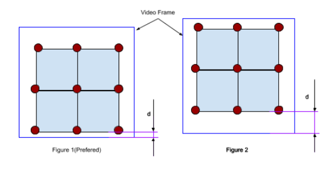

#Introduction

Social Distance Maintainer is our small step to aware people about social distancing. This system is designed to work for people standing in a multiple queue. It will detect the people violating social distance in a queue, and play warning if they do not maintain social distancing for a long period of time(Can be decided by our client. Current default value is 5 seconds). Warning audio will be played in loop(with some gap in between, 5 seconds to be exact) until people maintain required social distance again.

#Objective

To help maintain social distancing in people's queues.
To help to reduce the pace of Covid-19 Spread.

#Requirements

##Conditions

###Grid Size

This system is designed for multiple lines of people. So, there must be at least 4 people with two at rows and two at columns. In easy language, there must be at least 2x2 grid. In case of maximum, we have tested this for 4x3 grid during development. However, it will perfectly work for a higher range.

###Camera Position

Camera position should be in such a way, so that people in the queue can be visible in straight lines not diagonal. For example:

###Camera Height

We have tested our system by placing the camera in normal room height i.e. 10ft. It will work better within range 8ft to 12ft. 

###Camera Angle

For optimal results, try to make the camera angle equal to 45 degrees. There is one other thing to consider when adjusting camera angle and that is distance between mark points along with the bottom area of the frame. For example:

In figure 1, the distance between the bottom area of frame and lower markings has very less gap in comparison to figure 2. And that is the preferable camera angle along with near to 45 degrees.

Also, try to make the markings to cover the video frame as much as possible. For example:

Here, in above figures, figure 1 covers more areas in the video frame than figure 2. That is why figure 1 is preferred than figure 2 for optimal result.

##Hardware Requirements

For this system, we will require following devices:
CPU which includes:
Memory 8GB or higher.
Processor i5 or higher. 
Nvidia GeForce GTX-1080 or higher.
IP Camera(Normal View)
Monitor to display output.
Speaker to play warning.
Keyboard/Mouse to control.

##Software Requirements
To install this system, we will first need to install cuDNN 7.6 and CUDA 10.1 along with Python version 3.7.
 
Below, is a youtube tutorial link about how to install cuDNN and CUDA in windows 10.

Link: https://www.youtube.com/watch?v=2TcnIzJ1RQs&feature=emb_title
Now you need to create a virtual environment.  We prefer Anaconda to create virtual environments. However, you can also create one with Pip.

To install anaconda and create new virtual environment, please follow following youtube tutorial:

Link: https://www.youtube.com/watch?v=mIB7IZFCE_k

To create virtual environment with pip, please follow the following youtube tutorial:

Link: https://www.youtube.com/watch?v=UqkT2Ml9beg

After creating a virtual environment, you need to install packages listed in requirements.txt in that environment. You can use following command to install all the packages listed in requirements.txt file:

pip install -r requirements.txt

Along with this, we need to install an IDE. It is not mandatory but preferred for the long run. There are a lot of IDEs, but I personally prefer VS Code.

#One-time Setup

These are the settings to make just once after the camera is set. After that, you can always go to the How to run section directly whenever you want to run our program.

##Get Camera IP address

Get the ip address of the IP camera. It can either start with rtsp or http or https or tcp or udp.
Anyone will do fine.

##Edit Config File

This is not mandatory. But if you want different output, you can edit our config file and the program will run according to that settings.
Config file is located inside SupportingFiles and named as config.txt which contains the following elements you can change as you wish.

ignore value = Ignore human detection, if the bounding box height is less than specified value. Currently, our program will ignore human detection if the bounding box height is less than 200.
inside_main_zone = The value in inside_main_zone decides the area of freedom to move from marking points for people who are standing inside the main zone. Currently, people have 20% of the social distance gap as an area of freedom. For example, if we have kept social distance to maintain as 1.5 m, people can go up to 1.2 m and still warning audio will not be played. But if he goes less than 1.2, it will play warning.
boundary_zones_with_zone = Same as inside_main_zone, but for people who are in boundary zones but near to the main zone.
boundary_zones = Same as above, but for people who are in boundary zones and far from the main zone.
full_screen = If it is True, it will show the output in full screen, if it is False, it will show the output in 1280 width frame.
show_humans_detected = If it is True, it will show a green dot for every human detected.
gap = It is the time to wait between playing warnings. There may be 1-5 seconds variations than the actual gap defined, due to various processing in the program. We suggest you to not change this value for optimal performance.
color = This is the color for the bounding box for those people who violates social distancing. It is currently red. If you want, you can change the BGR values for it.

{
	'ignore_value': 200, 
	'inside_main_zone': 0.8, 
	'boundary_zones_with_main_zone': 0.7, 
	'boundary_zones': 0.6, 
	'full_screen': True, 
	'show_humans_detected': False,
	'gap': 5, 
	'color': (0, 0, 255)

}

##Run draw_grid.py
Open command prompt.

Activate your virtual environment. SDMaintainer is in my case.

Run draw_grid.py with command “python draw_grid.py”.

It will ask for a video path, number of rows and number of people in each row. Provide the information.

After that, it will ask you to click the markings where people are going to stand. 

Remember, you need to follow Left to right and up to bottom rule when clicking at the marks.

After that, it will ask for nearest markings(based on horizontal and vertical lines) for each mark in the ground. For example, in above figure, for mark 1, there are 2 near points i.e. 2 and 4. Similarly, for mark 2 there are 3 near points i.e. 1, 3 and 5. And for mark 5, there 4 near points i.e. 2, 4, 6 and 8. 

#How to run?

Open command prompt.

Activate your virtual environment. SDMaintainer is in my case.

Run Social_Distance_Maintainer.py file with command”
python Social_Distance_Maintainer.py

	This will open an GUI like below:

Here, you can choose a webcam and insert ip camera address or you can browse saved video or if you want to play a demo of our system, you can go for it.

Time to wait is the time of freedom to give people standing in a queue before playing warning even if they violate the social distancing rule. You can choose various options using that drop down menu. It ranges from 5 seconds to 60 seconds. Default is 5 seconds.

Alert file is the sound file you want to play as warning audio. We also have implemented a default audio. If you want to use your own custom audio, it is also possible. Just keep in mind that it should be in .wav format.

And after pressing the proceed button, it will start the system.

